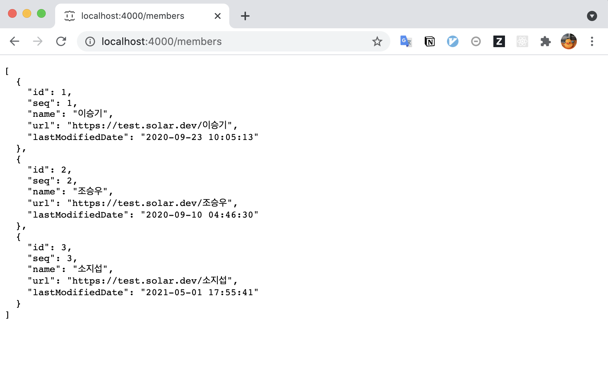

# 목 서버 with. Json-Server

Created: Apr 22, 2021 10:43 PM

# 1. 목데이터 파일 작성

"mockdata.json" 이라는 이름의 파일을 생성해줌

```jsx
{
  "members": [
    {
      "id": 1,
      "seq": 1,
      "name": "이승기",
      "url": "https://test.solar.dev/이승기",
      "lastModifiedDate": "2020-09-23 10:05:13"
    },
    {
      "id": 2,
      "seq": 2,
      "name": "조승우",
      "url": "https://test.solar.dev/조승우",
      "lastModifiedDate": "2020-09-10 04:46:30"
    },
    {
      "id": 3,
      "seq": 3,
      "name": "소지섭",
      "url": "https://test.solar.dev/소지섭",
      "lastModifiedDate": "2021-05-01 17:55:41"
    }
  ]
}
```

# 2. json-server 실행

앞서 만든 mockdata.json 파일이 있는 위치에서 4000번 포트로 서버를 실행해준다.

```jsx
json-server ./mockdata.json --port 4000
```

# 3. 데이터 조회

- `[localhost:4000](http://localhost:4000)` 으로 접근하면 서버 메인페이지 확인가능


## GET - 목록확인

- 데이터를 보려면 url에 앞서 작성했던 mockdata.json의 첫번쨰 key 값을 지정해주면 된다.

```jsx
[http://localhost:4000/](http://localhost:4000/windows)members
```



## GET - 하나의 데이터 확인

- json-server에서는 `id` 값으로 데이터를 구분하므로 확인하려는 레코드의 `id`값을 url에 지정해주면 된다.

```jsx
[http://localhost:4000/](http://localhost:4000/windows)members/1
```


## POST - 레코드 생성

- POST로 json 형태의 데이터 값을 body에 담아서 전송하면 id 값을 auto increment로 생성해준다.

```jsx
POST http://localhost:4000/members

{
  "seq": 4,
  "name": "김태리",
  "url": "https://test.solar.dev/조승우",
  "lastModifiedDate": "2020-09-10 04:46:30"
}
```


목록을 다시 확인해보면 id값이 자동으로 부여되고 새롭게 데이터가 추가되었다.


## PUT - 레코드 수정

- url에 수정하려는 레코드의 id를 지정하고 body에 수정하려는 내용을 json 타입으로 담고, PUT으로 전송

```jsx
PUT http://localhost:4000/members/1

{
  "seq": 1,
  "name": "아이유",
  "url": "https://test.solar.dev/아이유",
  "lastModifiedDate": "2021-05-02 04:46:30"
}
```


## DELETE - 레코드 삭제

- 삭제하려는 레코드의 id를 url에 지정해서 DELETE로 전송

```jsx
DELETE http://localhost:4000/members/1
```


해당 id의 레코드가 삭제된다.


---

# 참고

[typicode/json-server](https://github.com/typicode/json-server#routes)

[8. json-server](https://react.vlpt.us/redux-middleware/08-json-server.html)